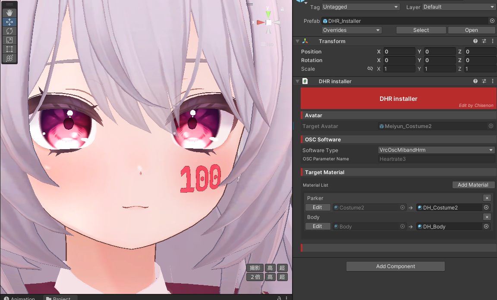

# DHR Installer

lilToon-DecalHeartRate用の自動セットアップツール

## 概要

**DHR Installer** は、Avatar に非破壊で心拍数表示機能を追加するための NDMF (Modular Avatar) 製コンポーネントです。

lilToon-DecalHeartRate シェーダーを使用したマテリアルの自動セットアップと、Avatar の OSC 関連の Animation を簡単に導入できます。

複雑な手動設定を排除し、GUI ベースの簡単操作で心拍数表示システムを構築できます。

## 主な機能

| 機能 | 説明 |
|------|------|
| **マテリアル自動設定** | 選択されたマテリアルに lilToon-DecalHeartRate シェーダーを適用 |
| **OSC パラメーター連携** | 心拍数 OSC ソフトウェアとの自動パラメーター設定 |
| **アニメーター統合** | NDMF を利用した自動アニメーター設定 |
| **ビルド時処理** | アバタービルド時の自動マテリアル置換とプロパティ設定 |

::: info 前提条件
- Unity 2019.4.31f1以降
- VRChat SDK3 - Avatars
- lilToon v2.0.0以降
- Modular Avatar (NDMF) v1.8.0以降
- lilToon-DecalHeartRate

:::

## 対応OSCソフトウェア

DHR Installer は以下の OSC 心拍数送信ソフトウェアに対応しています

- [**BluetoothHeartRateOSC**](https://github.com/AkaiMage/BluetoothHeartRateOSC)
- [**HRtoVRChat_OSC**](https://github.com/200Tigersbloxed/HRtoVRChat_OSC)
- [**VrcOscMibandHrm**](https://github.com/vard88508/vrc-osc-miband-hrm)
- **Other** (カスタム設定)

## セットアップ方法

詳細なセットアップ手順は [使い方](/ja_JP/dhri/dhri_usage) ページをご覧ください。
