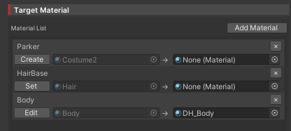

# DHR Installer 使い方

DHR Installer を使用した lilToon-DecalHeartRate の自動セットアップガイド

## 使用手順

<div class="timeline">

<div class="timeline_part">
<div class="timeline_label">STEP 1</div>
<div class="timeline_title">前提条件の確認</div>
<div class="timeline_text">

DHR Installer を使用する前に、以下のパッケージがインストールされていることを確認してください。

**必須パッケージ**
- [lilToon](https://lilxyzw.github.io/lilToon/) v2.0.0以降
- [lilToon-DecalHeartRate](../lildhr/dhr_index)
- [Modular Avatar](https://modular-avatar.nadena.dev/ja) v1.8.0以降

**心拍数を OSC で送信できる環境**
- [BluetoothHeartRateOSC](https://github.com/AkaiMage/BluetoothHeartRateOSC)
- [HRtoVRChat_OSC](https://github.com/200Tigersbloxed/HRtoVRChat_OSC)
- [VrcOscMibandHrm](https://github.com/vard88508/vrc-osc-miband-hrm)
- [VRCOSC](https://github.com/VolcanicArts/VRCOSC)

</div>
</div>

<div class="timeline_part">
<div class="timeline_label">STEP 2</div>
<div class="timeline_title">DHR Installer コンポーネントの追加</div>
<div class="timeline_text">

アバターのルートに set up された Prefab を配置

1. Project または Packages の中から以下のPrefabを探します

```sh
Assets/ChiseNote/DHR_Installer/DHR_Installer.prefab
```

2. 上記の `DHR_Installer.prefab` を Hierarchy のアバターの中にドラッグ&ドロップします。


::: tip 
Prefab のスクリプト上部にアバターが自動で検出・表示されれば成功です。

::: details 成功例


:::

</div>
</div>

<div class="timeline_part">
<div class="timeline_label">STEP 3</div>
<div class="timeline_title">OSC設定</div>
<div class="timeline_text">

使用する OSC ソフトウェアに応じてパラメーターを設定します

**OSC Software Type** から選択
- **BluetoothHeartRateOSC** (`HeartRateBPM`)
- **HRtoVRChat_OSC** (`HeartRateBPM`)
- **VrcOscMibandHrm** (`MiBandHR`)
- **VRCOSC** (`VRCOSC/Heartrate/Value`)
- **Other** (カスタム設定)


::: warning パラメーター名の注意
**Other** を選択した場合、**Custom Parameter Name** に送信ソフトウェアで使用しているパラメーター名を正確に入力してください。
:::

::: danger 注意
送信される OSC Parameter は INT 型のみ対応しています。
:::

</div>
</div>

<div class="timeline_part">
<div class="timeline_label">STEP 4</div>
<div class="timeline_title">マテリアル選択</div>
<div class="timeline_text">

心拍数を表示したいマテリアルを選択・設定します

1. **Material Selection** セクションで **[Add Material]** ボタンをクリック
2. リストから編集したい Mesh を選択
3. 心拍数を表示したい Material を選択しリストに追加


::: tip Target Material のボタンについて
リストに Material が追加されると、下記のボタンのどれかが表示されます。
- **Create**: 現在の Material を複製し `lilToon-DecalHeartRate` Shader を適用した Material を新しく作成します。(`DH_` という接頭辞のついた Material が生成されます)
- **Set**: すでに `Create` で Material を作成している場合、その Material を再度適用します。
- **Edit**: 指定された Material を編集します。

::: details 表示例

:::

</div>
</div>

<div class="timeline_part">
<div class="timeline_label">STEP 5</div>
<div class="timeline_title">ビルドとテスト</div>
<div class="timeline_text">

設定完了後、アバターをビルドしてテストします

1. Unity の再生ボタンや、**VRChat SDK** > **Build & Publish** でアバタービルド
2. **VRChat** でアバターをテスト
3. **OSC ソフトウェア** を起動して心拍数送信を開始
4. アバターに心拍数が表示されることを確認

::: warning ビルド後の動作
**DHR Installer** は NDMF を使用して作成されているため、ビルド時に Avatar に統合され自動でアバターの Animator に設定されます。
:::

</div>
</div>

</div>

## よくある質問

### Q： 心拍数が表示されない

**A：** 以下を確認してください

1. **OSC パラメーター名**が送信ソフトウェアと一致しているか
2. **マテリアル設定**が正しく適用されているか
3. **VRChat の OSC 機能**が有効になっているか
4. **OSC ソフトウェア**が正常に動作しているか

### Q： ビルド時にエラーが発生する

**A：** 以下を確認してください

1. **必須パッケージ**がすべてインストールされているか
2. **NDMF** が正常に動作しているか
3. **Modular Avatar** のバージョンが対応しているか

## 関連ドキュメント

- [lilToon-DecalHeartRate概要](/ja_JP/lildhr/dhr_index)
- [Number Decal設定](/ja_JP/lildhr/dhr_number)
- [Texture Decal設定](/ja_JP/lildhr/dhr_texture)