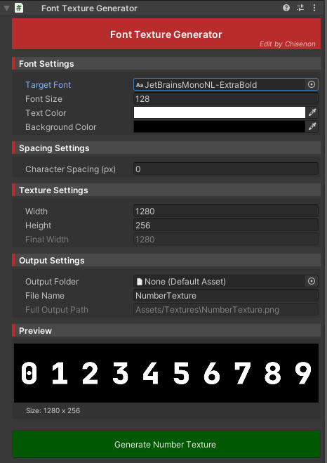

# Font2Texture Generator

Unity で Project 内のフォントファイルから、専用の Sprite Texture を生成するツール

## 概要

**Font2Texture Generator** は、Unity のプロジェクトでフォントファイルから数値表示用のスプライトテクスチャを自動生成するツールです。

[`lilToon-DecalHeartRate`](../lildhr/dhr_index)などの数値表示シェーダーで使用する「NumberTexture」を、任意のフォントから簡単に作成するためのツールです。

## セットアップ
### [詳しいセットアップ方法はこちら](../f2t/f2t_setup)

## 主な機能

### Font2Texture Generator
- Unity Project 内の任意のフォントファイルから数値テクスチャを自動生成
- 0-9の数字を横一列に配置したスプライトテクスチャ形式
- フォントサイズ、文字色、背景色、文字間隔の調整が可能
- 出力先フォルダとファイル名の指定

## 注意事項

- Unity Editor 環境でのみ動作します
- 生成されるテクスチャは 0-9 の数字のみです
- フォントファイルは Project 内に配置されている必要があります

::: warning 重要
Font2Texture Generator は Editor 専用ツールなので、**ビルドには含まれません**。

Hierarchy に含めた状態でビルドしても問題ありません。
:::