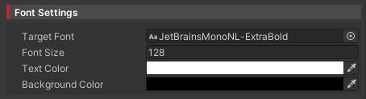
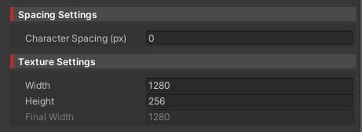
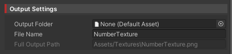
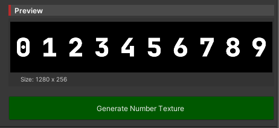

# セットアップガイド

Font2Texture Generator の導入と基本的な使い方を解説します。

## 導入手順と基本的な使い方

<div class="timeline">

<div class="timeline_part">
<div class="timeline_label">STEP 1</div>
<div class="timeline_title">Font2Texture Generator の配置</div>
<div class="timeline_text">

**方法1: Prefab を使用（推奨）**
- VPM版: `Packages/Chise - Font2Texture/Font2Tex.prefab` を Hierarchy にドラッグ&ドロップ
- Package版: `Assets/ChiseNote/Font2Texture/Font2Tex.prefab` を Hierarchy にドラッグ&ドロップ

**方法2: 手動セットアップ**
1. 空の GameObject を作成する
2. 作成した GameObject に`ChiseNote/Font Texture Generator`コンポーネントをアタッチ

```bash
Unity Editor > Hierarchy > 右クリック > Create Empty
Inspector > Add Component > ChiseNote/Font Texture Generator
```

::: info
Font2Texture Generator は Editor 専用ツールなので、**ビルドには含まれません**。

Hierarchy に含めた状態でビルドしても問題ありません！
:::

</div>
</div>

<div class="timeline_part timeline_part_sub">
<div class="timeline_label">STEP 2</div>
<div class="timeline_title">フォント設定</div>
<div class="timeline_text">

Inspector 上で基本的なフォント設定を行います

1. **Target Font (Inspector)**: 使用したいフォントアセット（.ttf、.otf ファイル）を指定
2. **Font Size**: 生成する数字のサイズ（推奨: 128）
3. **Text Color**: 数字の色（通常は白 #FFFFFF）
4. **Background Color**: 背景色（通常は透明 Alpha = 0）



::: tip フォント設定のコツ
- **Font Size** は最終的な表示用途より少し大きめに設定し、必要に応じて縮小すると綺麗に表示されます
- **VRChat 用途**では文字の色を白にして Shader で変更する方法がおすすめです。
:::

</div>
</div>

<div class="timeline_part timeline_part_sub">
<div class="timeline_label">STEP 3</div>
<div class="timeline_title">テクスチャ設定</div>
<div class="timeline_text">

数字テクスチャのサイズと配置を調整します

1. **Base Texture Width**: 10文字分の幅（推奨: 1280px = 128px × 10）
2. **Texture Height**: テクスチャの高さ（推奨: 128px）
3. **Character Spacing**: 各数字間のスペース（0〜100px）



::: warning サイズの注意点
Unity 標準では**2のべき乗サイズ**（512、1024、2048など）が推奨されますが、Font2Texture では用途に応じて調整してください。
:::

</div>
</div>

<div class="timeline_part timeline_part_sub">
<div class="timeline_label">STEP 4</div>
<div class="timeline_title">出力設定</div>
<div class="timeline_text">

テクスチャの保存先を指定します

1. **Output Folder**: 保存先フォルダを選択（DefaultAsset 形式）
2. **Output File Name**: 出力ファイル名（例: `NumberTexture`）



```bash
# Default の保存先
Assets/
  Textures/
    NumberTexture.png  ← ここに生成されます
```

</div>
</div>

<div class="timeline_part timeline_part_sub">
<div class="timeline_label">STEP 5</div>
<div class="timeline_title">テクスチャ生成</div>
<div class="timeline_text">

設定が完了したら、テクスチャを生成します

1. Inspector 下部の [**Generate Number Texture**] ボタンをクリック
2. **Generated Texture** フィールドにプレビューが表示されます
3. 指定したフォルダに PNG ファイルが保存されます



::: tip プレビュー確認
生成前に **Generated Texture** フィールドでプレビューを確認し、設定を調整してから保存することをおすすめします。
:::

</div>
</div>

</div>

## 実装/出力の補足

- 生成されたファイル名は Inspector の **File Name** で指定した名前に ".png" を付与したものが出力されます。

## よくある質問

### Q： 生成されたテクスチャが表示されない

**A：** 以下を確認してください

- **Font Asset**が正しく設定されているか
- **Output Folder**の権限に問題がないか
- **Font Size**が大きすぎていないか（あまり大きすぎると表示されません）