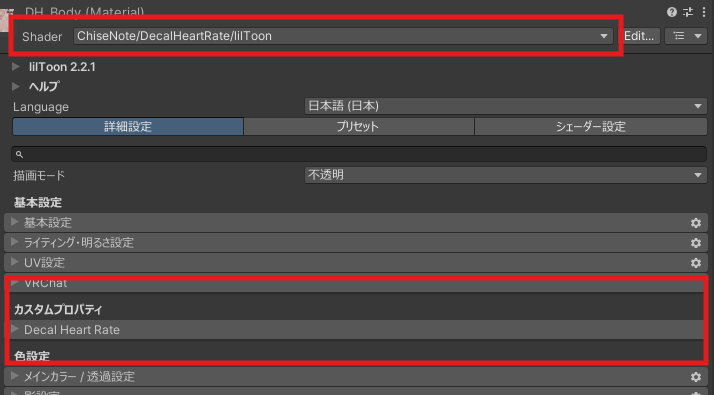

# lilToon-DecalHeartRate

lilToon ベースの心拍数表示に特化した Decal Shader

## 概要

**lilToon-DecalHeartRate** は、心拍数として送られた任意の数値を表示する機能を持った lilToon ベースのカスタムシェーダーです。OSC 通信などを利用して Shader を適応した Material を制御することで、リアルタイムに心拍数を表示することも可能です。

| 機能 | 説明 |
|------|------|
| **心拍数表示** | 数値テクスチャ（`NumberTexture.png`）を使用して心拍数を表示 |
| **デカール機能** | 既存の Material 設定に重ねてテクスチャを重ねて表示 |
| **エミッション制御** | 指定された心拍数（`Heart Rate (OSC)`）に応じてエミッションの強度を動的に変更 |
| **スケール制御** | 指定された心拍数（`Heart Rate (OSC)`）に応じてテクスチャのスケールを動的に変更 |

## 主な機能

### [Number Decal](/ja_JP/lildhr/dhr_number) - 心拍数を数字で表現
- `Heart Rate (OSC)` で受け取った心拍数値を Number Texture で表示
- 数値の配置設定（`Position X`, `Position Y`）
- スケール・回転調整（`Sync Scale X/Y`, `Scale X`, `Scale Y`, `Rotation`）
- 表示形式設定（`Display Length`, `Alignment`, `Character Offset`, `Digit Spacing`）

### [Texture Decal](/ja_JP/lildhr/dhr_texture) - 心拍数をテクスチャで表現
- テクスチャ（`Texture Decal`）による心拍数の視覚表現
- 位置・回転・スケール調整（`Position`, `Rotation`, `Scale`）
- 心拍数連動エミッション制御（`HeartRateEmission`）
- 心拍数連動スケール制御（`HeartRateScale`）

## セットアップ手順

STEP 1

lilToon-DecalHeartRate のインストール

VPM から lilToon-DecalHeartRate をインストールします

1. VPM や BOOTH から package を追加
2. VCC/ALCOM でプロジェクトを開く

::: info 前提条件
lilToon v2.0.0 以降が事前にインストールされている必要があります。
:::

STEP 2

シェーダーの変更

マテリアルのシェーダーを変更します

1. Unity Inspector でマテリアルを選択
2. Shader 欄を `ChiseNote/DecalHeartRate/lilToon` に変更
3. カスタムインスペクターが表示されることを確認

STEP 3

Decal機能の有効化

詳細な設定方法は下記のドキュメントを参照してください。

- **心拍数を数字で表示**: [`Number Decal`](./dhr_number) のチェックボックスを ON
- **心拍数をテクスチャで表示**: [`Texture Decal`](./dhr_texture) のチェックボックスを ON

STEP 4

表示設定の調整

各種設定をスライダーや数値入力で調整します

- **Position**: 表示位置の調整（X, Y 座標）
- **Scale**: サイズの調整
- **Rotation**: 回転角度の設定
- **Display Length**: 表示桁数の設定（数字表示の場合）

::: tip OSC 設定
VRChat での動的制御には、OSC で心拍数を送信し `Heart Rate (OSC)` パラメータを操作します。
:::

## 注意事項

- lilToon v2.0.0 以降が必要です

::: warning バージョンの注意
lilToon のバージョンによっては正常に動作しない場合があります。

必ず最新バージョンをご利用ください。
:::