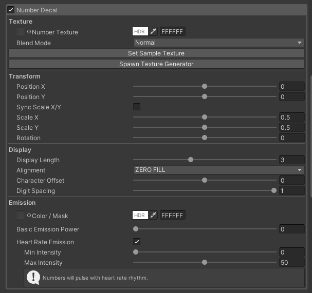

# Number Decal 機能

数値テクスチャを使用して心拍数を表示する Number Decal 機能の詳細解説

## 機能概要

**Number Decal** は、`Heart Rate (OSC)` で取得した数値を、専用の数値テクスチャ（`NumberTexture.png`）を使用してアバターに表示する機能です。
デカール処理で描画しているため、既存のテクスチャの上に数値を重ね合わせて表示します。

## 簡単なセットアップ手順

STEP 1

シェーダーの設定

マテリアルの Shader を「ChiseNote/DecalHeartRate/lilToon」に変更します

1. Unity Inspector でマテリアルを選択
2. Shader 欄を`ChiseNote/DecalHeartRate/lilToon`に設定
3. カスタム インスペクターが表示されることを確認

STEP 2

機能の有効化

Number Decal 機能を有効にします

1. `Number Decal` チェック ボックスを**On**に設定
2. Number Decal 関連の設定項目が表示されることを確認

STEP 3

数値テクスチャの設定

数値表示用のテクスチャを設定します

1. `NumberTexture` フィールドにテクスチャを設定
2. または「Set Sample Texture」ボタンでサンプルを自動割り当て
3. `Blend Mode` を**Normal**または**Multiply**に設定

::: tip テクスチャがない場合
「Spawn Texture Generator」ボタンで Font2Texture ツール（`Font2Tex.prefab`）を Hierarchy に生成し、カスタム フォントから数値テクスチャを生成できます。
:::

STEP 4

表示位置とサイズの調整

数値の表示位置とサイズを調整します

1. **Position X/Y**： 表示位置を調整（-1.0 ～ 1.0）
2. **Scale X/Y**： サイズを調整（0.0 ～ 2.0）
3. **Rotation**： 回転角度を設定（-180° ～ 180°）

STEP 5

表示形式の設定

数値の表示形式を設定します

1. **Display Length**： 表示桁数を設定（1-6桁）
2. **Alignment**： 整列方法を選択（ZERO FILL / SHIFT RIGHT / SHIFT LEFT）
3. **Digit Spacing**： 桁間の間隔を調整（0.1 ～ 2.0）

::: info エミッション設定
必要に応じて`Heart Rate Emission`を有効にすると、心拍数に応じてエミッションの強度が変化します。
:::

## 基本設定

### メイン設定

| Inspector 表示 | 説明 | 設定範囲 | Parameter |
|---------------|------|----------|-----------------|
| Number Decal | 数値表示の有効/無効 | On/Off | `_ActiveDecalNumber` |
| Number Texture | 数値用テクスチャ | Texture | `_SpriteNumberTexture` |
| Blend Mode | ブレンドモードの選択 | Normal / Multiply | `_NumberTextureBlendMode` |

### 拡張機能の呼び出し

| Inspector 表示 | 説明 | 設定/挙動 | Parameter |
|---------------|------|----------|----------|
| Set Sample Texture (Button) | NumberTextureをマテリアルに自動で割り当てます。サンプルが見つからない場合はボタンが無効化されます。 | ボタン操作（クリックで割当） |  |
| Spawn Texture Generator (Button) | `Font2Tex` プレハブをHierarchyに生成して、任意のフォントから数値テクスチャを作成する補助ツールを追加します。 | ボタン操作（HierarchyにPrefab追加または既存選択） |  |

---

::: info 拡張機能の使い方
- 「Set Sample Texture」ボタンで素早くサンプルを割り当てられます。
見つからない場合は手動で `NumberTexture` を指定してください。
- 「Spawn Texture Generator」はフォントから自動で`NumberTexture`を作るための補助ツールです。
すでに存在する場合はそれを選択します。
:::

### 表示設定

| Inspector 表示 | 説明 | 設定値 | Parameter |
|---------------|------|--------|-----------------|
| Visibility Mode | 心拍数が0のときの表示制御 | Always Show (常に表示) / Hide Below Zero (0のときだけ非表示) | `_HideDecalNumberWhenZero` |

::: tip Visibility Mode について
**Visibility Mode** を`Hide Below Zero`に設定すると、心拍数が0の場合に数値表示が自動的に非表示になります。心拍数センサーが接続されていない状態やアイドル時に「0」が表示されるのを防ぐことができます！
:::

### 位置・スケール設定

| Inspector 表示 | 説明 | 設定範囲 | Parameter |
|---------------|------|----------|-----------------|
| Position X / Position Y  | 表示位置のX/Yをスライダーで調整 | -1.0 ～ 1.0 | `_TexPositionXVector` / `_TexPositionYVector` |
| Sync Scale X/Y & Scale X / Scale Y  | スケールを同期する or 個別に調整 | 0.0 ～ 2.0 | `_SyncDecalNumberTextureScale` / `_TexScaleXVector` / `_TexScaleYVector` |
| Rotation | 回転角度 | -180° ～ 180° | `_NumTexRotation` |

## 表示形式設定

### 数値表示設定

| Inspector 表示 | 説明 | 設定値 | Parameter |
|---------------|------|--------|-----------------|
| Display Length | 表示桁数を指定 | 1 ～ 6桁 | `_NumTexDisplaylength` |
| Alignment | 整列方法を選択 | ZERO FILL / SHIFT RIGHT / SHIFT LEFT | `_NumTexAlignment` |
| Character Offset | 文字単位のオフセット（X方向） | -1.0 ～ 1.0 | `_NumTexCharacterOffset` |
| Digit Spacing | 桁ごとの間隔（スケール） | 0.1 ～ 2.0 | `_NumTexDigitSpacing` |

## エミッション設定

| Inspector 表示 | 説明 | 設定範囲 | Parameter |
|---------------|------|----------|-----------------|
| Color / Mask (Texture + Color) | エミッション用のマスクと色を設定 | Texture / Color | `_DecalNumberEmissionMask` / `_DecalNumberEmissionColor` |
| Basic Emission Power | Default のエミッション強度 | 0 ～ 100 | `_DecalNumberEmissionStrength` |
| Main Color Power | エミッション色とテクスチャ色のブレンド比率 | 0.0 ～ 1.0 | `_DecalNumberMainColorPower` |

::: tip Main Color Power について
**Main Color Power** は、エミッション色（Emission Color）と数値テクスチャの色（Number Texture Color）をブレンドする比率を調整する機能です。

- **0.0**: エミッション色のみを使用
- **0.5**: エミッション色とテクスチャ色を50%ずつブレンド
- **1.0**: 数値テクスチャの色のみを使用  

:::

## 心拍連動エミッション

| Inspector 表示 | 説明 | 設定範囲 | Parameter |
|---------------|------|----------|-----------------|
| Heart Rate Emission | 心拍連動エミッションを有効化 | On/Off | `_UseHeartRateEmission` |
| Min Intensity / Max Intensity | 心拍連動時の最小・最大エミッション強度 | 0 ～ 100 | `_HeartRateEmissionMin` / `_HeartRateEmissionMax` |

::: tip エミッション制御の効果
心拍数が高いほどエミッションが強くなる効果です。数値が高いほどエミッションが強くなります。
:::
