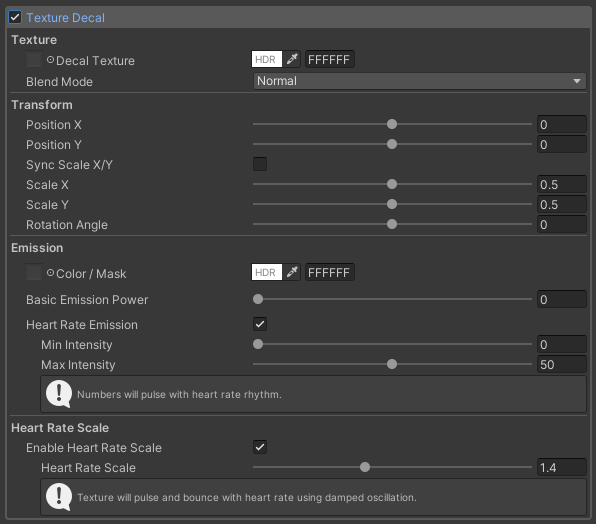

# Texture Decal 機能

テクスチャを使用して心拍数を表示する Texture Decal 機能の詳細解説

## 機能概要

**Texture Decal** は、`Heart Rate (OSC)` から取得した心拍数値に応じて、指定されたテクスチャを表示・制御する機能です。ハートマークや抽象的なデザインなど、数値以外の視覚的な方法で心拍数を表現できます。デカール処理で描画しているため、既存のテクスチャの上にテクスチャを重ね合わせて表示します。

## 簡単なセットアップ手順

STEP 1

シェーダーの設定

マテリアルの Shader を「ChiseNote/DecalHeartRate/lilToon」に変更します

1. Unity Inspector でマテリアルを選択
2. Shader 欄を `ChiseNote/DecalHeartRate/lilToon` に設定
3. カスタムインスペクターが表示されることを確認

STEP 2

機能の有効化

Texture Decal 機能を有効にします

1. `Texture Decal` チェックボックスを**On**に設定
2. Texture Decal 関連の設定項目が表示されることを確認

STEP 3

デカールテクスチャの設定

心拍数表示用のテクスチャを設定します

1. `Texture Decal` に任意のテクスチャを設定（ハートマーク等）
2. `Color` で色調整（必要に応じて）
3. `Blend Mode` を**Normal**または**Multiply**に設定

::: tip テクスチャ選択のコツ
ハートマークや抽象的なデザインなど、心拍数を視覚的に表現できるテクスチャがおすすめです。
:::

STEP 4

表示位置とサイズの調整

テクスチャの表示位置とサイズを調整します

1. **Position X/Y**: 表示位置を調整（-1.0 ～ 1.0）
2. **Scale X/Y**: サイズを調整（0.0 ～ 2.0）
3. **Rotation Angle**: 回転角度を設定（-180° ～ 180°）

STEP 5

心拍連動効果の設定

動的な効果を追加します（オプション）

1. **Heart Rate Emission**: エミッションを心拍数に連動させる
2. **Heart Rate Scale**: スケールを心拍数に連動させる（脈動効果）
3. 強度設定で Min/Max 値を調整

::: info 心拍連動効果
- **エミッション**: 心拍数が高いほどテクスチャが明るく光ります
- **スケール**: 心拍数に応じてテクスチャが脈動するように変化します
:::

## 基本設定

### メイン設定

| Inspector 表示 | 説明 | 設定範囲 | Parameter |
|---------------|------|----------|----------|
| Texture Decal | テクスチャ表示の有効/無効 | On/Off | `_ActiveDecalTexture` |
| Texture Decal | デカール用のカスタムテクスチャ | Texture | `_DecalTexture` |
| Color | テクスチャの色調整 | HDRカラー | `_DecalTextureColor` |
| Blend Mode | ブレンドモードの選択 | Normal / Multiply | `_DecalTextureBlendMode` |

### 位置・スケール設定 (Inspector 表示と対応パラメータ)

| Inspector 表示 | 説明 | 設定範囲 | Parameter |
|---------------|------|----------|----------|
| Position X / Position Y | 表示位置のX/Yをスライダーで調整 | -1.0 ～ 1.0 | `_DecalPositionXVector` / `_DecalPositionYVector` |
| Sync Scale X/Y & Scale X / Scale Y | スケールを同期するか個別に調整 | 0.0 ～ 2.0 | `_SyncDecalTextureScale` / `_DecalScaleXVector` / `_DecalScaleYVector` |
| Rotation Angle | 回転角度 | -180° ～ 180° | `_DecalRotation` |

## エミッション設定

| Inspector 表示 | 説明 | 設定範囲 | Parameter |
|---------------|------|----------|----------|
| Color / Mask (Texture + Color) | エミッション用のマスクと色を設定 | Texture / Color | `_DecalTextureEmissionMask` / `_DecalTextureEmissionColor` |
| Basic Emission Power | ベーシックなエミッション強度 | 0 ～ 100 | `_DecalTextureEmissionStrength` |
| Main Color Power | エミッション色とテクスチャ色のブレンド比率 | 0.0 ～ 1.0 | `_DecalTextureMainColorPower` |

::: tip Main Color Power について
**Main Color Power** は、エミッション色（Emission Color）とデカールテクスチャの色（Decal Texture Color）をブレンドする比率を調整する機能です。
- **0.0**: エミッション色のみを使用
- **0.5**: エミッション色とテクスチャ色を50%ずつブレンド
- **1.0**: デカールテクスチャの色のみを使用  
:::

## 心拍連動エミッション
| Inspector 表示 | 説明 | 設定範囲 | Parameter |
|---------------|------|----------|----------|
| Heart Rate Emission | 心拍連動エミッションを有効化 | On/Off | `_UseHeartRateEmissionTexture` |
| Min Intensity / Max Intensity | 心拍連動時の最小・最大エミッション強度 | 0 ～ 100 | `_HeartRateEmissionMinTexture` / `_HeartRateEmissionMaxTexture` |

::: tip エミッション制御の効果
心拍数が高いほどエミッションが強くなる効果です。数値が高いほどエミッションが強くなります。
:::

## 心拍連動スケール制御
| Inspector 表示 | 説明 | 設定範囲 | Parameter |
|---------------|------|----------|----------|
| Enable Heart Rate Scale (チェック) | 心拍連動スケール機能を有効化 | On/Off | `_UseHeartRateScaleTexture` |
| Heart Rate Scale (スライダー) | スケール変動の強度（Inspector 表示は1.0-2.0、内部は0.0-1.0） | 1.0 ～ 2.0 | `_HeartRateScaleIntensity` |

::: tip スケール制御の効果
心拍数が高いほどテクスチャが大きく表示される効果です。ハートマークなどで使用すると、心臓の鼓動を表現できます。
:::

::: tip 心拍連動機能の活用
- **エミッション制御**: 心拍数が高いほどテクスチャが明るく光ります
- **スケール制御**: 心拍数に応じてテクスチャが脈動するように大小に変化します
- **組み合わせ効果**: 両方を有効にすると、より動的で印象的な表現が可能です
:::
